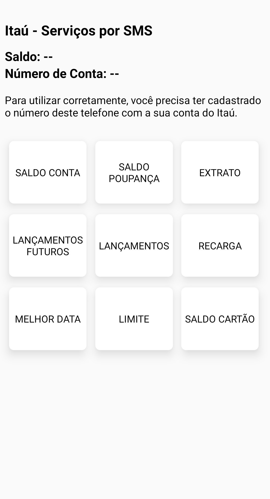
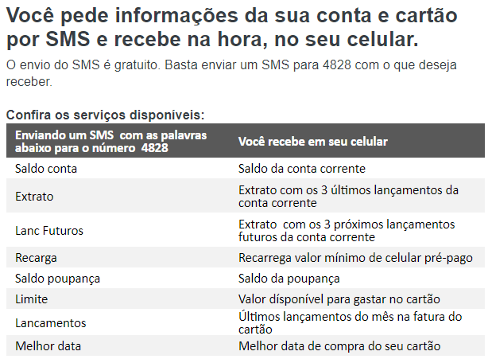

# rn-itau-sms-services
Um aplicativo que consulta serviços SMS do banco Itaú como se fosse uma API. Consulta saldos, extratos, melhor data e etc., tudo sem logar.

> PS.: esse é um dos poucos, se não o único aplicativo criado com intenção de estudos que eu acabo utilizando por ser muito útil! 🤑
>
> Para consultar o saldo, no aplicativo do Itaú, é necessário logar, e este processo demora, enquanto aqui, com 1 toque eu consigo a mesma informação!



> ⚠️ [FUNCIONA SOMENTE EM ANDROID] Requer que o número do seu celular esteja cadastrado no aplicativo do Itaú. Será enviado mensagens para o número 4828 para consultar as informações, envios são gratuitos.

## Funcionalidades:

- Ao entrar no aplicativo, ele irá fazer uma chamada por SMS para o número 4828 enviando a mensagem "SALDO CONTA", onde o aplicativo irá aguardar a resposta do SMS e informar o saldo da conta em tela, juntamente com os últimos digítos da sua conta.
- Além dos serviços por SMS, dispostos e descritos no site oficial do Itaú:



## Recursos técnicos:

- **SMS IN BACKGROUND**: Para o funcionamento do envio e consulta de mensagens SMS em background, foi escrito um pequeno `module` e `package` nativo do Android e "linkado" com o React Native.

```JAVA
//./android/app/src/main/java/com/_appName/DirectSmsPackage.java

public class DirectSmsPackage implements ReactPackage {
 
    @Override
    public List<ViewManager> createViewManagers(ReactApplicationContext reactContext) {
        return Collections.emptyList();
    }
 
    @Override
    public List<NativeModule> createNativeModules(
            ReactApplicationContext reactContext) {
        List<NativeModule> modules = new ArrayList<>();
        //this is where you register the module
        modules.add(new DirectSmsModule(reactContext));
        return modules;
    }
}
```

```JAVA
//./android/app/src/main/java/com/_appName/DirectSmsModule.java

public class DirectSmsModule extends ReactContextBaseJavaModule {
 
    public DirectSmsModule(ReactApplicationContext reactContext) {
        super(reactContext); //required by React Native
    }
 
    @Override
    //getName is required to define the name of the module represented in JavaScript
    public String getName() { 
        return "DirectSms";
    }
 
    @ReactMethod
    public void sendDirectSms(String phoneNumber, String msg) {
        try {      
            SmsManager smsManager = SmsManager.getDefault();
            smsManager.sendTextMessage(phoneNumber, null, msg, null, null);    
        } catch (Exception ex) {
            System.out.println("couldn't send message.");
        } 
    }
}
```
